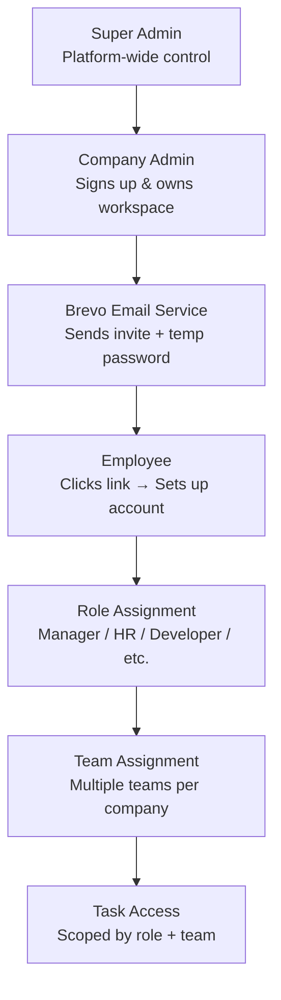

# 🏢 Enterprise Access Management — Implementation Plan
### Task Manager SaaS → Full Enterprise RBAC + Team Management

---

> [!IMPORTANT]
> This plan upgrades the existing SaaS architecture from a simple **admin/member** model to a full **enterprise-grade** system with: Company Admin signup → Brevo email invitations → Employee onboarding → RBAC with granular job profiles → Multi-team support.

---

## 📐 Architecture Overview



### Current State vs Target State

| Feature | Current | Target |
|---|---|---|
| Signup | Anyone can sign up | **Admin-only** with company registration |
| Members | Invited by admin | Invited via **Brevo email** with temp password |
| Roles | `admin` / `member` | **8 granular job profiles** + custom roles |
| Teams | ❌ Not implemented | **Multi-team** per workspace |
| Email | ❌ None | **Brevo transactional emails** |
| Employee Setup | Basic form | **Guided account setup wizard** |

---

## 🗂️ Phase Breakdown

| Phase | Scope | Estimated Work |
|---|---|---|
| **Phase A** | DB Schema — RBAC, Teams, Job Profiles | ~2-3 hrs |
| **Phase B** | Admin-Only Signup & Company Registration | ~2 hrs |
| **Phase C** | Brevo Email Integration + Edge Function | ~3 hrs |
| **Phase D** | Employee Account Setup Flow | ~2 hrs |
| **Phase E** | Admin Panel — User & Role Management | ~3 hrs |
| **Phase F** | Team Management System | ~2 hrs |
| **Phase G** | Permission-Aware Task Access | ~2 hrs |
| **Phase H** | Polish & Notifications | ~1 hr |

---

## 🅰️ Phase A — Database Schema Upgrade

### A1. New SQL File: `supabase/phase7_enterprise_rbac.sql`

**Changes to `profiles` table:**
```sql
ALTER TABLE profiles ADD COLUMN IF NOT EXISTS job_profile TEXT DEFAULT 'employee'
  CHECK (job_profile IN (
    'company_admin', 'manager', 'hr', 'developer', 'designer',
    'qa_engineer', 'devops', 'finance', 'sales', 'employee'
  ));

ALTER TABLE profiles ADD COLUMN IF NOT EXISTS department TEXT;
ALTER TABLE profiles ADD COLUMN IF NOT EXISTS phone      TEXT;
ALTER TABLE profiles ADD COLUMN IF NOT EXISTS employee_id TEXT;
ALTER TABLE profiles ADD COLUMN IF NOT EXISTS status TEXT DEFAULT 'active'
  CHECK (status IN ('active', 'inactive', 'pending_setup'));
ALTER TABLE profiles ADD COLUMN IF NOT EXISTS invited_by UUID REFERENCES profiles(id);
ALTER TABLE profiles ADD COLUMN IF NOT EXISTS setup_completed BOOLEAN DEFAULT false;
ALTER TABLE profiles ADD COLUMN IF NOT EXISTS temp_password_hash TEXT; -- cleared after setup
```

**New `teams` table:**
```sql
CREATE TABLE IF NOT EXISTS teams (
  id           UUID DEFAULT gen_random_uuid() PRIMARY KEY,
  workspace_id UUID REFERENCES workspaces(id) ON DELETE CASCADE NOT NULL,
  name         TEXT NOT NULL,
  description  TEXT,
  color        TEXT DEFAULT '#6366f1',
  icon         TEXT DEFAULT 'users',
  created_by   UUID REFERENCES profiles(id) ON DELETE SET NULL,
  created_at   TIMESTAMPTZ DEFAULT NOW(),
  updated_at   TIMESTAMPTZ DEFAULT NOW(),
  UNIQUE(workspace_id, name)
);
```

**New `team_members` table:**
```sql
CREATE TABLE IF NOT EXISTS team_members (
  team_id  UUID REFERENCES teams(id) ON DELETE CASCADE,
  user_id  UUID REFERENCES profiles(id) ON DELETE CASCADE,
  role     TEXT DEFAULT 'member' CHECK (role IN ('lead', 'member')),
  joined_at TIMESTAMPTZ DEFAULT NOW(),
  PRIMARY KEY (team_id, user_id)
);
```

**Upgrade `workspace_members` role column:**
```sql
ALTER TABLE workspace_members DROP CONSTRAINT IF EXISTS workspace_members_role_check;
ALTER TABLE workspace_members ADD CONSTRAINT workspace_members_role_check
  CHECK (role IN ('company_admin', 'manager', 'hr', 'developer', 'designer',
                  'qa_engineer', 'devops', 'finance', 'sales', 'employee', 'viewer'));
```

**New `employee_invitations` table:**
```sql
CREATE TABLE IF NOT EXISTS employee_invitations (
  id             UUID DEFAULT gen_random_uuid() PRIMARY KEY,
  workspace_id   UUID REFERENCES workspaces(id) ON DELETE CASCADE,
  email          TEXT NOT NULL,
  job_profile    TEXT NOT NULL,
  department     TEXT,
  team_id        UUID REFERENCES teams(id) ON DELETE SET NULL,
  invited_by     UUID REFERENCES profiles(id),
  token          TEXT UNIQUE NOT NULL,  -- secure random token in link
  temp_password  TEXT NOT NULL,         -- plaintext stored briefly, cleared on setup
  status         TEXT DEFAULT 'pending' CHECK (status IN ('pending', 'accepted', 'expired')),
  expires_at     TIMESTAMPTZ DEFAULT NOW() + INTERVAL '7 days',
  accepted_at    TIMESTAMPTZ,
  created_at     TIMESTAMPTZ DEFAULT NOW()
);
```

**New `permission_overrides` table (fine-grained):**
```sql
CREATE TABLE IF NOT EXISTS permission_overrides (
  id           UUID DEFAULT gen_random_uuid() PRIMARY KEY,
  workspace_id UUID REFERENCES workspaces(id) ON DELETE CASCADE,
  user_id      UUID REFERENCES profiles(id) ON DELETE CASCADE,
  permission   TEXT NOT NULL,  -- e.g. 'tasks.create', 'users.view', 'reports.export'
  granted      BOOLEAN DEFAULT true,
  granted_by   UUID REFERENCES profiles(id),
  created_at   TIMESTAMPTZ DEFAULT NOW(),
  UNIQUE(workspace_id, user_id, permission)
);
```

**Extend tasks table:**
```sql
ALTER TABLE tasks ADD COLUMN IF NOT EXISTS team_id UUID REFERENCES teams(id) ON DELETE SET NULL;
ALTER TABLE tasks ADD COLUMN IF NOT EXISTS visibility TEXT DEFAULT 'workspace'
  CHECK (visibility IN ('workspace', 'team', 'private'));
```

### A2. RLS Policies for New Tables

```sql
-- Teams: workspace members can read; admins/managers can manage
ALTER TABLE teams ENABLE ROW LEVEL SECURITY;
ALTER TABLE team_members ENABLE ROW LEVEL SECURITY;
ALTER TABLE employee_invitations ENABLE ROW LEVEL SECURITY;
ALTER TABLE permission_overrides ENABLE ROW LEVEL SECURITY;

CREATE POLICY "Workspace members read teams"
  ON teams FOR SELECT
  USING (workspace_id IN (
    SELECT workspace_id FROM workspace_members WHERE user_id = auth.uid()
  ));

CREATE POLICY "Admins manage teams"
  ON teams FOR ALL
  USING (workspace_id IN (
    SELECT workspace_id FROM workspace_members
    WHERE user_id = auth.uid() AND role IN ('company_admin', 'manager')
  ));
```

### A3. Helper Functions

```sql
-- Check if user is company admin for a workspace
CREATE OR REPLACE FUNCTION is_company_admin(p_workspace_id UUID)
RETURNS BOOLEAN AS $$
  SELECT EXISTS (
    SELECT 1 FROM workspace_members
    WHERE workspace_id = p_workspace_id
      AND user_id = auth.uid()
      AND role = 'company_admin'
  );
$$ LANGUAGE sql STABLE SECURITY DEFINER;

-- Get user's effective permissions
CREATE OR REPLACE FUNCTION get_user_permissions(p_workspace_id UUID)
RETURNS TEXT[] AS $$
DECLARE
  v_role TEXT;
  v_permissions TEXT[];
BEGIN
  SELECT role INTO v_role FROM workspace_members
  WHERE workspace_id = p_workspace_id AND user_id = auth.uid();
  
  -- Base permissions by role
  CASE v_role
    WHEN 'company_admin' THEN
      v_permissions := ARRAY['tasks.*', 'users.*', 'teams.*', 'reports.*', 'settings.*'];
    WHEN 'manager' THEN
      v_permissions := ARRAY['tasks.*', 'users.view', 'teams.*', 'reports.view'];
    WHEN 'hr' THEN
      v_permissions := ARRAY['users.*', 'tasks.view', 'reports.view'];
    ELSE
      v_permissions := ARRAY['tasks.view', 'tasks.update_own'];
  END CASE;
  
  RETURN v_permissions;
END;
$$ LANGUAGE plpgsql SECURITY DEFINER;
```

---

## 🅱️ Phase B — Admin-Only Signup & Company Registration

> [!NOTE]
> The public `/signup` route is **removed** from the landing page. Only Company Admins sign up via a dedicated `/admin/register` page. Employees are invited, not self-registered.

### B1. New Page: `src/pages/Auth/AdminRegister.jsx`

**Form fields:**
- Full Name
- Work Email
- Password (with strength indicator)
- Company Name
- Company Size (dropdown: 1-10, 11-50, 51-200, 200+)
- Industry (dropdown: IT, Healthcare, Finance, Education, Retail, Other)
- Phone Number
- **Invite Token** (optional — for beta, require a secret token to prevent public registrations)

**On submit:**
1. `supabase.auth.signUp()` with `raw_user_meta_data: { role: 'company_admin', name, company }`
2. Call `create_workspace_with_admin()` RPC to create workspace
3. Set `profiles.job_profile = 'company_admin'`
4. Set `workspace_members.role = 'company_admin'`
5. Redirect to Admin Dashboard with a success tour

### B2. Route Updates in `App.jsx`

```jsx
// Remove /signup from public routes
// Add /admin/register as a special public route
<Route path="/admin/register" element={<AdminRegister />} />

// Remove the old /signup route entirely (employees get invited)
```

### B3. Update `OAuthCallback` 

Redirect `company_admin` job_profile to `/admin/dashboard`, not generic role check.

---

## 🅲 Phase C — Brevo Email Integration

### C1. Supabase Edge Function: `supabase/functions/send-employee-invite/index.ts`

**Trigger:** Called from Admin Panel when inviting an employee.

```typescript
// POST /functions/v1/send-employee-invite
// Body: { email, name, jobProfile, department, teamId, workspaceId }

import { serve } from 'https://deno.land/std/http/server.ts'
import { createClient } from 'https://esm.sh/@supabase/supabase-js'

const BREVO_API_KEY = Deno.env.get('BREVO_API_KEY')
const BREVO_URL = 'https://api.brevo.com/v3/smtp/email'
const APP_URL = Deno.env.get('APP_URL') || 'http://localhost:5173'

serve(async (req) => {
  const { email, name, jobProfile, department, workspaceId, workspaceName } = await req.json()

  // 1. Generate secure token + temp password
  const token = crypto.randomUUID().replace(/-/g, '')
  const tempPassword = generateSecurePassword() // 12-char random

  // 2. Store invitation in DB
  const supabase = createClient(
    Deno.env.get('SUPABASE_URL')!,
    Deno.env.get('SUPABASE_SERVICE_ROLE_KEY')!
  )
  
  await supabase.from('employee_invitations').insert({
    workspace_id: workspaceId,
    email, job_profile: jobProfile, department,
    token, temp_password: tempPassword,
    invited_by: (await supabase.auth.getUser()).data.user?.id
  })

  // 3. Send Brevo email
  const setupLink = `${APP_URL}/setup-account?token=${token}`
  
  const emailPayload = {
    sender: { name: workspaceName, email: 'noreply@yourdomain.com' },
    to: [{ email, name: name || email }],
    subject: `You're invited to join ${workspaceName} on TaskFlow`,
    htmlContent: buildInviteEmailHTML({
      name, workspaceName, jobProfile, setupLink, tempPassword
    })
  }

  const res = await fetch(BREVO_URL, {
    method: 'POST',
    headers: { 'api-key': BREVO_API_KEY!, 'Content-Type': 'application/json' },
    body: JSON.stringify(emailPayload)
  })

  return new Response(JSON.stringify({ success: res.ok }), { status: 200 })
})
```

### C2. Email Template — `buildInviteEmailHTML()`

**Marketing-quality HTML email with:**
- Company logo / TaskFlow branding header (gradient indigo/purple)
- Personalized greeting: "Hi [Name], [CompanyName] has invited you..."
- Role badge: "Your role: **Senior Developer**"
- Temporary credentials box (styled)
- Big CTA button: "Set Up Your Account →"
- Security notice: "This link expires in 7 days. Don't share your temp password."
- Footer with social links, unsubscribe

### C3. Environment Variables to Add

```env
# Add to .env
BREVO_API_KEY=your_brevo_api_key_here
VITE_APP_URL=http://localhost:5173
```

### C4. Service Layer: `src/services/invitationService.js`

```javascript
export const inviteEmployee = async ({ email, name, jobProfile, department, teamId }) => {
  const { data, error } = await supabase.functions.invoke('send-employee-invite', {
    body: { email, name, jobProfile, department, teamId }
  })
  if (error) throw error
  return data
}

export const getPendingInvitations = async (workspaceId) => {
  return supabase
    .from('employee_invitations')
    .select('*')
    .eq('workspace_id', workspaceId)
    .eq('status', 'pending')
    .order('created_at', { ascending: false })
}

export const revokeInvitation = async (invitationId) => {
  return supabase
    .from('employee_invitations')
    .update({ status: 'expired' })
    .eq('id', invitationId)
}

export const resendInvitation = async (invitationId) => {
  // Calls edge function to re-send email with same token
  return supabase.functions.invoke('resend-employee-invite', { body: { invitationId } })
}
```

---

## 🅳 Phase D — Employee Account Setup Flow

### D1. New Public Route: `/setup-account?token=xxx`

**Page: `src/pages/Auth/SetupAccount.jsx`**

**Step 1 — Token Validation:**
```javascript
// On mount, query employee_invitations where token matches + status='pending' + not expired
const { data: invite } = await supabase
  .from('employee_invitations')
  .select('*, workspaces(name, logo_url)')
  .eq('token', token)
  .eq('status', 'pending')
  .gt('expires_at', new Date().toISOString())
  .single()

if (!invite) → Show "Invalid or expired link" error page
```

**Step 2 — Multi-step Setup Wizard (3 steps):**

```
Step 1: Welcome & Identity
  - Shows: "Welcome to [Company]! You've been invited as [Job Profile]"
  - Fields: Full Name (pre-filled), Profile Photo upload
  - Read-only: Email, Job Profile, Department

Step 2: Set Your Password
  - New Password (with strength meter)
  - Confirm Password
  - Security tip tooltip

Step 3: Complete Profile
  - Phone Number (optional)
  - Employee ID (optional)
  - Bio / About (optional)
  - Preferred notification method
```

**On completion:**
1. `supabase.auth.signUp({ email, password: newPassword })` OR if user exists, use admin API to update password
2. Update `employee_invitations.status = 'accepted'`
3. Update `profiles.setup_completed = true`, `profiles.status = 'active'`
4. Clear `temp_password` from invitations
5. Add user to `workspace_members` with correct role
6. If `team_id` in invitation → add to `team_members`
7. Redirect to `/user/dashboard` with welcome animation

### D2. New Page: `src/pages/Auth/SetupExpired.jsx`
Friendly error page: "This invitation has expired. Contact your company admin."

---

## 🅴 Phase E — Admin Panel: User & Role Management

### E1. Enhanced `ManageUsers.jsx` → Full RBAC Manager

**New layout: tabbed interface**
- Tab 1: **All Employees** — table with avatar, name, email, job profile badge, team, status
- Tab 2: **Pending Invitations** — list with resend/revoke actions
- Tab 3: **Role Templates** — define permission bundles per job profile

**Employee Table Columns:**
| Name | Email | Job Profile | Department | Team | Status | Actions |
|------|-------|-------------|------------|------|--------|---------|

**Inline actions per employee:**
- 🔄 Change Role (dropdown)
- 🏷️ Change Department
- 👥 Assign to Team
- 🔒 Deactivate Account
- 🗑️ Remove from Workspace

### E2. New Invite Employee Modal

**Fields:**
- Email Address *
- Full Name
- Job Profile (dropdown with icons for each profile)
- Department (text or dropdown)
- Assign to Team (optional multi-select)
- Personal Message (optional, appended to email)

**Job Profile Options (with icons):**
| Icon | Profile | Description |
|------|---------|-------------|
| 👔 | Manager | Team lead, can manage tasks & members |
| 👩‍💼 | HR | Human resources, user management |
| 💻 | Developer | Software engineer |
| 🎨 | Designer | UI/UX designer |
| 🔍 | QA Engineer | Quality assurance |
| ⚙️ | DevOps | Infrastructure & deployment |
| 💰 | Finance | Financial operations |
| 📊 | Sales | Sales and marketing |
| 👤 | Employee | General employee |

### E3. Permission Matrix UI

**New page: `src/pages/Admin/PermissionMatrix.jsx`**

Visual grid showing which job profiles have which permissions:

```
                    | Create Task | View Reports | Manage Users | ...
--------------------|-------------|--------------|--------------|
company_admin       |     ✅      |      ✅      |      ✅      |
manager             |     ✅      |      ✅      |      ❌      |
hr                  |     ❌      |      ✅      |      ✅      |
developer           |     ✅      |      ❌      |      ❌      |
...
```

Admins can toggle individual permission overrides per user.

---

## 🅵 Phase F — Team Management System

### F1. New Page: `src/pages/Admin/ManageTeams.jsx`

**Features:**
- Create/Edit/Delete teams
- Assign color + emoji icon per team
- View team members
- Set team lead (can be Manager role)
- Team analytics: task count, completion rate

**Team Card UI:**
```
┌─────────────────────────────┐
│ 🔵 Frontend Team            │
│ Lead: John Doe              │
│ 8 members · 24 tasks        │
│ ████████░░ 80% completion   │
│ [View] [Edit] [Delete]      │
└─────────────────────────────┘
```

### F2. Team Context Updates

```javascript
// src/context/WorkspaceContext.jsx — add teams
const [teams, setTeams] = useState([])
const [currentTeam, setCurrentTeam] = useState(null)

const fetchTeams = async (workspaceId) => {
  const { data } = await supabase
    .from('teams')
    .select('*, team_members(user_id, role, profiles(name, profile_image_url))')
    .eq('workspace_id', workspaceId)
  setTeams(data || [])
}
```

### F3. Team-Scoped Task Filtering

Tasks can be filtered by:
- All Tasks (admin view)
- My Team's Tasks
- My Tasks Only

---

## 🅶 Phase G — Permission-Aware Task Access

### G1. Update Task Creation

```javascript
// src/pages/Admin/CreateTask.jsx updates:
// - Add "Assign to Team" field (dropdown of teams)
// - Add "Visibility" field (Workspace / Team / Private)
// - Only managers+ can assign tasks to team members
// - HR can view but not create tasks
```

### G2. Frontend Permission Guard Hook

New file: `src/hooks/usePermissions.js`

```javascript
export const usePermissions = () => {
  const { profile, currentWorkspaceMember } = useContext(UserContext)
  
  const can = (permission) => {
    const role = currentWorkspaceMember?.role
    const ROLE_PERMISSIONS = {
      company_admin: ['*'],
      manager: ['tasks.*', 'teams.*', 'users.view', 'reports.*'],
      hr: ['users.*', 'tasks.view', 'reports.view'],
      developer: ['tasks.view', 'tasks.update_own', 'teams.view'],
      // ... etc
    }
    
    const userPerms = ROLE_PERMISSIONS[role] || []
    return userPerms.includes('*') || 
           userPerms.includes(permission) ||
           userPerms.includes(permission.split('.')[0] + '.*')
  }
  
  return { can, role: currentWorkspaceMember?.role }
}
```

**Usage in components:**
```jsx
const { can } = usePermissions()

{can('users.manage') && <InviteEmployeeButton />}
{can('tasks.create') && <CreateTaskButton />}
{can('reports.view') && <ReportsLink />}
```

### G3. Role-Based Sidebar

Different nav items shown based on job profile:

| Nav Item | Admin | Manager | HR | Developer |
|---|---|---|---|---|
| Dashboard | ✅ | ✅ | ✅ | ✅ |
| All Tasks | ✅ | ✅ | ✅ (view) | ✅ (own) |
| Manage Users | ✅ | ❌ | ✅ | ❌ |
| Manage Teams | ✅ | ✅ | ❌ | ❌ |
| Invite Employee | ✅ | ✅ | ✅ | ❌ |
| Audit Log | ✅ | ❌ | ❌ | ❌ |
| Permissions | ✅ | ❌ | ❌ | ❌ |
| Reports | ✅ | ✅ | ✅ | ❌ |

---

## 🅷 Phase H — Polish, Notifications & Optimization

### H1. Welcome Email (Post-Setup)

After employee completes account setup → send a Brevo "Welcome" email:
- Subject: "Welcome to [Company] on TaskFlow! 🎉"
- Shows their role, team, quick-start tips

### H2. Admin Notification System

When employee accepts invite → notify company admin via:
1. In-app toast
2. Optional: Brevo email to admin "John Doe has joined your team as Developer"

### H3. Security Hardening

- Temp passwords cleared from DB after account setup
- Invitation tokens are single-use
- Expired invitations auto-cleaned via Supabase Cron
- Rate limit invitation sends (max 20/hour via Edge Function)

### H4. Audit Log Extensions

New events to log:
- `employee.invited`
- `employee.setup_completed`
- `role.changed`
- `team.created`
- `team.member_added`
- `permission.overridden`

---

## 📁 File Structure After Implementation

```
src/
├── pages/
│   ├── Auth/
│   │   ├── AdminRegister.jsx        ← NEW (replaces /signup)
│   │   ├── SetupAccount.jsx         ← NEW (employee onboarding)
│   │   ├── SetupExpired.jsx         ← NEW (expired token page)
│   │   ├── Login.jsx                (existing, unchanged)
│   │   └── AcceptInvite.jsx         (existing, kept for back-compat)
│   ├── Admin/
│   │   ├── ManageUsers.jsx          ← UPGRADED (full RBAC manager)
│   │   ├── ManageTeams.jsx          ← NEW
│   │   ├── InviteEmployee.jsx       ← NEW (modal component)
│   │   ├── PermissionMatrix.jsx     ← NEW
│   │   └── ...existing files
│   └── User/
│       └── ...existing files
├── hooks/
│   ├── usePermissions.js            ← NEW
│   └── useTeams.js                  ← NEW
├── services/
│   ├── invitationService.js         ← NEW
│   ├── teamService.js               ← NEW
│   └── ...existing services
└── context/
    ├── WorkspaceContext.jsx         ← UPGRADED (add teams)
    └── userContext.jsx              ← UPGRADED (add job_profile, permissions)

supabase/
├── phase7_enterprise_rbac.sql      ← NEW
└── functions/
    ├── send-employee-invite/
    │   └── index.ts                ← NEW
    └── resend-employee-invite/
        └── index.ts                ← NEW
```

---

## 🔧 Environment Variables Required

```env
# Existing
VITE_SUPABASE_URL=...
VITE_SUPABASE_ANON_KEY=...
SUPABASE_SERVICE_ROLE_KEY=...

# NEW — Add these
BREVO_API_KEY=your_brevo_api_key
VITE_APP_URL=https://yourdomain.com  # or http://localhost:5173 for dev
VITE_ADMIN_REGISTER_SECRET=strong_secret_here  # locks admin registration
```

---

## 🚀 Implementation Order (Start Here)

```
Week 1:
  [1] ✅ Run phase7_enterprise_rbac.sql in Supabase
  [2] ✅ Update profiles + workspace_members schema
  [3] ✅ Build AdminRegister page (replace /signup)
  [4] ✅ Build SetupAccount wizard

Week 2:
  [5] ✅ Set up Brevo account + get API key
  [6] ✅ Deploy send-employee-invite Edge Function
  [7] ✅ Upgrade ManageUsers page (RBAC tabs)
  [8] ✅ Build ManageTeams page

Week 3:
  [9] ✅ Build usePermissions hook
  [10] ✅ Update sidebar to be role-aware
  [11] ✅ Add team filtering to task views
  [12] ✅ PermissionMatrix page
  [13] ✅ Audit log new events + polish
```

---

## ❓ Open Questions / Decisions Needed

1. **Admin Registration Lock**: Should `/admin/register` be completely open or require a secret invite token from Super Admin? (Recommended: require token for production)
2. **Brevo Account**: Do you have a Brevo account? Need API key to configure email sending.
3. **Company Domain Restriction**: Should employee invitation only be sent to `@yourcompany.com` email addresses?
4. **Team Leads**: Should `Manager` role users be automatically set as team leads, or manual assignment?
5. **Password Policy**: What minimum password requirements? (length, complexity)
6. **Custom Roles**: Do you want to allow Company Admins to create their own custom job profiles beyond the 9 predefined ones?
